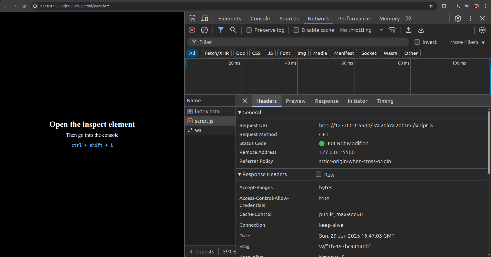
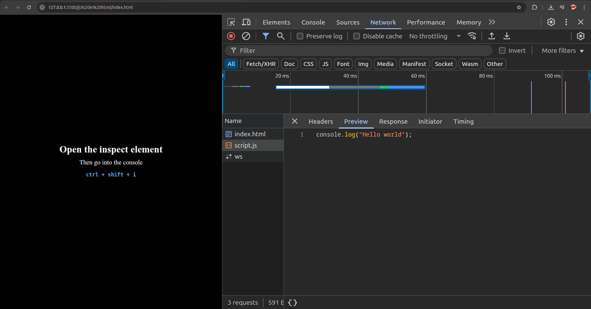
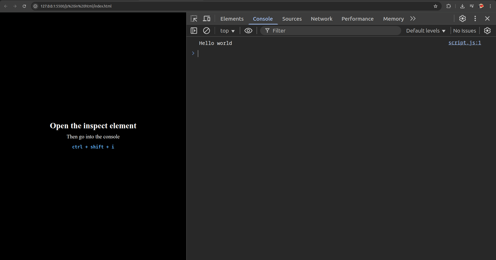
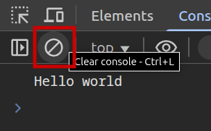
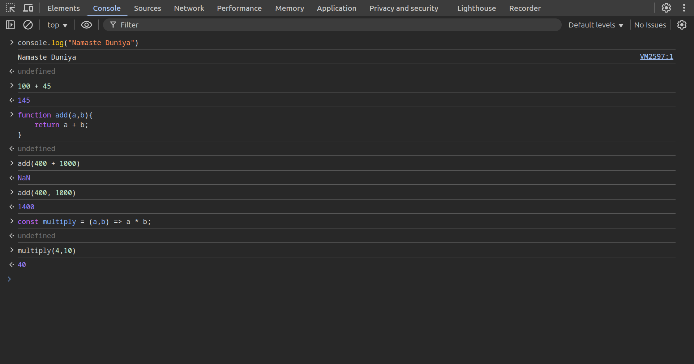
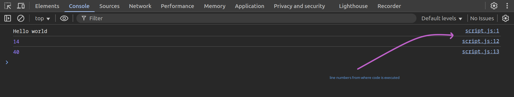
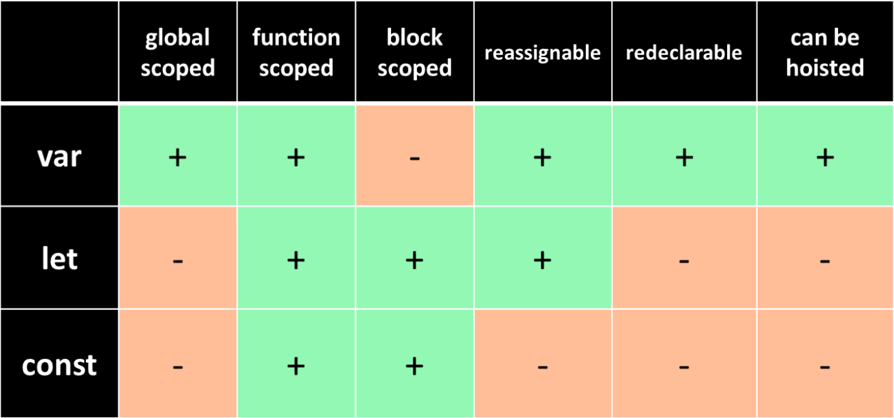
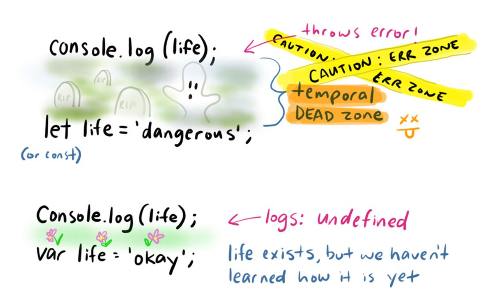
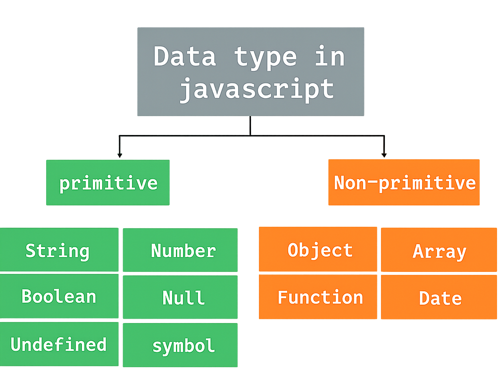
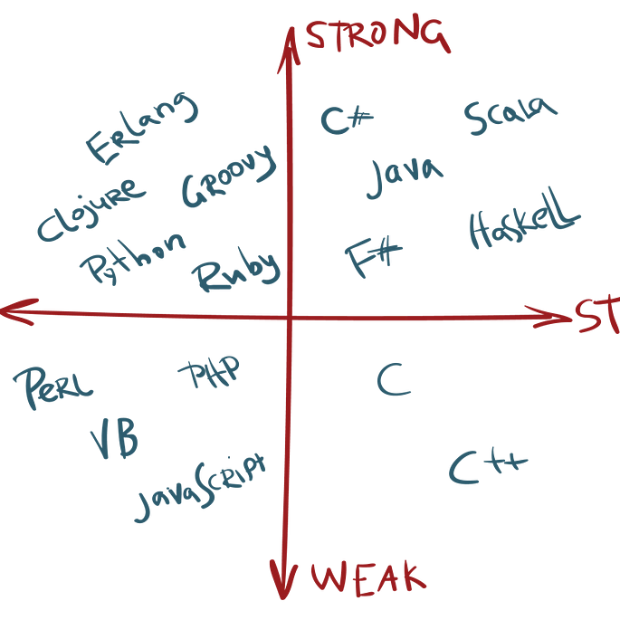

# History of JavaScript

### Static websites
- website having only `html` and `css` 
- no javascript (no interaction [static])
- NetScape used to have that kind of browser
- everything used to be static 
- simple calculations 
  - api response goes to server 
  - calculates whatever is requested
  - then returns to the user as static page to user


### JavaScript creation
- user's computer can do calculations (so make a language)
- `Brendan Eich`, created Mocha, later named LiveScript
- He made it in 10 days
- Later named `JavaScript` just for making it popular
- Jeff Atwood is the founder of stack overflow and in 2007 he said something called Atwood's law  
- `Jeff Atwood:` Any application that can be written in javaScript will be eventually written in javaScript


### Standardisation of JavaScript
-  Microsoft made `Jscript` taking things out of JavaScript
-  `ecma` European Computer Manufacturers Association
-  JavaScript was made standard by this organisation
-  ecma standard made JS the hero for all the browsers
-  that standard in called ECMAScript `ES6`, `ES7` ...

### NodeJS
- chrome came in the market with its own engine `v8` engine
- This `v8` was faster and better compiler for JavaScript
- Firefox made `SpiderMonkey` and other browsers made other engines
- `Ryan Dahl` took that `v8` engine and make `nodejs`
- This compilation now came outside of browser and locally compile `JS`
- `nodejs` runs on servers 

### Library and Frameworks
- Library is set of logic, Framework is specific set of rules on the logic
- Framework is restrictive and compulsive to follow a specific step of code
- `Angular`, `React`, `Next`, `Nest`, other library and frameworks evolved out of `nodejs`

### Interpreted or compiled ?
- for computer to understand it converts the code into 0s and 1s (binary)
- Interpreted: line by line conversion into binary.
- Compiled: entire file in coverted at once to binary.
- compiled is fast, error is also compiled, creates binary once
- interpreter can be paused on error and reinterpreted
- `JS` was compiled at first, so called twilight language
- `v8` took best of both worlds, from compiler and interpreter
- This new compilation is called __Just-In-Time__ compilation
- a component within a runtime environment that translates code during program execution, rather than before

<br>
<br>
<br>
<br>
<br>

#  JavaScript code compilation in browser
- set of instructions is called program
- program is converted into binary, 'JIT' compiler in JS
- What software to install for JS compilation?
- Connect `html` and `js` file 
- then open that html and look in terminal of the browser
- the console opened using `ctrl` + `shift` + `i`
- thereafter the javascript is executed in that REPL
- `REPL`: Read Evaluate Print Loop
- `<script src="./script.js" defer></script>`
- using this script and defer the `.js` file is linked to html
- the browser then executes the js in its runtime 







<br>
<br>

- The same `javaScript` can be written in the REPL console
- Read Evaluate Print Loop is used to execute things in runtime
- This REPL is used for constant compilation in browser environment
- up and down arrows are for the previous and next commands in history of REPL console
- `clear()` or `ctrl + l` are used to clear the console
- also there is a button 






- `ctrl + /` is to comment (ignore) the code
- `//` is used for commenting the code

<br>

```javascript
console.log("Hello world")


function addTwoNumbers(a, b) {
    return a + b
}


const multiply = (a, b) => a * b


console.log(addTwoNumbers(10, 4))
console.log(multiply(10, 4))

```




<br>
<br>
<br>
<br>
<br>

# Javascript Programming
- `ES6` and above is solid and sorted out versions of javascript and we are gonna learn that
- `ES` is for `ECMA` ECMAScript which is standardisation by European Computer Manufacturers Association
- keywords are some words with special meanings 
- some keywords are like `var`, `let`, `const`, `function`, `return`, `for`, etc
- john, sumit, apple, mango these are simply words, not containing any special meaning

<br>
<br>


## Variables 
- memory address containing some value inside it
- computer memory recognises that part as some special container 
- this container holds some specific value
- Variables are containers that hold data.
- used as the active memory of the program for computations
- Eg: Hero has some life/health points to signify the health in a game
- `score` is suppose some value which can be changing 
- some values dont change like pi is 3.1415... which is constant 
- `var`, `let`, `const` - three ways to make a variable  
- variable exists throughout the lifecycle of the program


#### ways to create a variable

```js
a = 12;

var a;
let a;
// const a; // cannot be done (error)

var a = 15;
let a = 20;

const a = 25;
```

<br>
<br>

- There are two steps for variable in memory
- Declaration: declare that variable is there. 
  - `var a;`, `let a;`
- Initialization: give first value to the variable. 
  - `let a = 12;`, `const pi = 3.1415`, `var name = "Sumit"`
- `var` is outdated — it's better to use `let` and `const` .
- `let` and `const` behave similarly, but const gives more safety
- `var`
  - Old and risky
  - adds itslef to window (environment)
  - function scoped (lifecycle of the function), Hoisted to the top with undefined value
  - Scoped to functions, not blocks (so can be accessed after the scope inside the function)
  - Can be redeclared and reassigned multiple times same variableName and no error shows
- `let`
  - used to make the variable 
  - Scoped to blocks `{}`
  - Can be reassigned but not redeclared
  - Hoisted, but stays in the Temporal Dead Zone (TDZ)
- `const`
  - Scoped to blocks `{}`
  - Cannot be reassigned or redeclared
  - Value must be assigned at declaration
  - TDZ applies here too

```js
var a = 13;
var a = 15;

let b = 20;
// let b = 25; // gives error
// SyntaxError: Identifier 'b' has already been declared

const groom = "Harsh"
const bride = "Priya"
// make sure that the bride and groom doesnot change
// TypeError: Assignment to constant variable.
```

var attaches to window


let doesnot attach to window


### const can change values sometimes
- If const holds an object/array, you can still change its contents:
- `const` prevents reassignment, but updation of values is allowed 
- `const` doesn't make things fully constant. It protects the variable, not the value.

```js
const student = { name: "Riya" };
student.name = "Priya";           // ✅ OK
student = {};                     // ❌ Error
```


<br>
<br>
<br>
<br>

### Scope 
- `{}` : local/block scope
- `function(){ // inside this }` : functional scope
- `entire program` : global scope (if not inside any `{}` but inside program)
- `let` and `const` follow block scope, inside some `{}`
- `var` ignores block scope (functional scoped) => leads to errors

```js
{
  var x = 5
  let y = 10
  const z = 15
}
console.log(x)
console.log(y)    // error (only block scoped)
console.log(z)    // error (only block scoped)
```

### `let` and `const` are block scoped

```js
let age = 5
let isBirthday = true

if (isBirthDay) {
  let age = 6
  console.log(age)  // 6
}
console.log(age)    // 5
```

#### `var` being functional scoped
- var is functional scoped, not block scoped, only respects function
- all the code goes inside a function
- so the entire program is functional scoped at end 
- so var is messed up inside the entire program (functional scoped)

```js
function abcd(){
    if(true){
        var answer = 96
    }
    console.log(answer)
}
abcd()
// console.log(answer) // error
```




<br>
<br>

### Temporal Dead Zone
- Area in which program knows the existence of variable 
- but cannot access the variable
- `TDZ` is the line till which the variable is initialized
- Before initialisation the variable is simply in memory but cannot be accessed
- happes in `let` and `const` - gives ReferenceError
- but not in `var`, it gives undefined

```js
console.log(a);

let a = 20;
// ReferenceError: Cannot access 'a' before initialization
```




<br>
<br>

### Hoisting
- JS prepares memory before running code
- __`Hoisting`__ : moves all the declarations to the top
- describe the state where variables are un-reachable.
- They are in scope(memory), but they aren't initialised.
- `let` and `const` give ReferenceError, `var` gives `undefined` in TDZ
- The `let` and `const` variables exist in the TDZ from the start of their enclosing scope until they are declared.

```js
{
    // This is the temporal dead zone for the age variable!
    // This is the temporal dead zone for the age variable!
    // This is the temporal dead zone for the age variable!
    // This is the temporal dead zone for the age variable!
    let age = 25; // Whew, we got there! No more TDZ
    console.log(age);
}
```


### why `var` gives undefined
- `var a = 15;` is broken into two parts 

```js
var a = undefined
a = 12
```

- so the declaration of the variable `var a = undefined` goes to the top
- initialisation part is at the point where we actually write the variable
- suppose at line 10 we wrote `var a = 12`, so there it gets initialized
- Use `const` by default. Use `let` only when you plan to change the value.
- Avoid `var` — it belongs to the past.

<br>
<br>
<br>
<br>
<br>

## Data types
- In JavaScript, every value has a type.
- These types define what kind of data is being stored — a number, text, boolean, object, etc.
- There are two categories:
  - Primitive 
    – stored directly.
    - already made we just copy them
    - copy the values of the variable
    - so everyone has their own values 
  - Reference 
    - stored as memory references.
    - values with brackets `()`, `{}`, `[]`
    - does not copy value, copies the pointer to location, (reference)
    - These are not copied directly, but by reference.
    - Every one has values put points to one location 
    - so doing changes in one variable changes all the other values



### Primitive Data types 
- `string`    : text, Eg: 'hello'', "Sumit", `JavaScript`, etc
- `Number`    : numeric value, Eg: 3, 4, -99, 3.1415, etc
- `Boolean`   : true / false
- `undefined` : value declared but not assigned, `let x`, here `x` is undefined
- `null`      : Intentional empty value, `let x = null`
- `Symbol`    : Unique identifier (rarely used)
- `BigInt`    : Very large integers `let y = 123456789012345678901234567890n`


#### Reference Data types 
- Object `{}`, Array `[]`, function `()`
- `Object` : `{ name: "Harsh", age: 26 }`
- `Array` : `[10, 20, 30]`
- `Function` : `function greet() {}`


### String
- `''`: single quotes  
- `""`: double quotes  
- ``` `` ```: backticks

```js
let naam = 'sumitjha'
let gender = `male`
let lastname = "jha"

// in double backticks the string can be multiline
`Hello, 
I am Sumit Kumar Jha, 
writing documentation for node and javascript
trying to make good material for revision`

"Hi, man are you Mnnit's student?" // "' are combined here
```


### Numeric value
- some decimal, whole number, integer, negative positive, all

```js
let a = 10
let b = -100
let c = 3.532
let d = -45.234
```

### Boolean 
- `true` or `false` value

```js
let isOnline = true
let isTyping = false
```

### null
- not given the value yet, but need to give value
- suppose a subject is to be choosen, mandatorily, but currently want to just no decide it

### undefined 
- by default value is called undefined 
- `undefined` -> not defined
- so if we just make the value and not assign it => `undefined`
- undefined is given by JS engine
- `null` is assigned by user
- NaN stands for "Not-a-Number", and it's a special value that represents an undefined or unrepresentable numeric result. It's a property of the global object and is of type number.
- `undefined` means the variable was never assigned.
- `null` means you intentionally set it to "nothing".

```js
let currentSubject = null   // need to take value, but now
let quirks = undefined      // undefined (given by user)
let profilePicture          // undefined
```

<br>
<br>


<br>
<br>


### Symbol
- unique `immutable` value
- Symbol is unique value identifier, for specific pointing (referencing)
- libraries used sometimes are changed when trying to change the values, there we can use the Symbol for making distinct variable, so does not overwrite the Symbol

```js
// Symbol
let person1 = 'Sumit'
let person2 = 'Sumit'
let person3 = Symbol('Sumit')
let person4 = Symbol('Sumit')

console.log(person1 === person2)  // true (since simple values are types compared)
console.log(person3 === person4)  // false (Specific instance of creation is checked)


let obj = {
    uid: 1,
    name: "Sumit", 
    age: 24, 
    email: "sumitjha1618@gmail.com"
}

console.log(obj)
console.log(obj.uid)

let u1 = Symbol("uid")
obj[u1] = 200

console.log(obj[u1])
```


### BigInt
- `Number.MAX_SAFE_INTEGER`: safe number that gives proper holding
- more than the `Number.MAX_SAFE_INTEGER` gives precision issues
- value more than 9007199254740991 we take BigInt, in BigInt and put n at end
- change in this values needs other to be BigInt as well (so put n at end)


```js
console.log(Number.MAX_SAFE_INTEGER) // 9007199254740991

let piggyBank = 12324565789000000000000n
piggyBank += 4n
console.log(piggyBank)              // 12324565789000000000004n
```

<br>
<br>
<br>


### Reference in (Non-Primitive Data Types)
- reference -> some pointer pointing to the original value is given 
- new variable takes the address of the old variable (not a copy)
- so changing new variable changes the old variable as well


```js
let selectedPlayers = [1, 2, 3, 7, 9, 10, 11]
let goingToTournament = selectedPlayers

goingToTournament.pop() // player #11 was removed 
console.log(goingToTournament)      // [ 1, 2, 3, 7, 9, 10 ]
console.log(selectedPlayers)        // [ 1, 2, 3, 7, 9, 10 ]


let object = {
    name: 'Cat'
}

let animal = object
animal.name = 'Dog'

console.log(animal.name)    // Dog
console.log(object.name)    // Dog but object was named cat, still changed
```

<br>
<br>



### Dynamic typing
- dont need to specify the data type of the variable 
- change the data further on in the variable 
- static typing is better than dynamic
- data types should be static for good programming/error handlings

```cpp
int a = 2;    // integer data type 
a = "Sumit";  // cannot change the data type
```

```js
let a = 2   // integer/number data type
a = true    // data type is changed into boolean
```

### typeof keyword
- check the data type using the typeof keyword
- this keyword gives the typeof data used 

```js
let name = "Sumit Kumar Jha";
let age = 24;
let isOnline = false;
let hasDisorders; // undefined
let kids = null; // not now but later in future
let friend = Symbol("sushmita");
let totalkarma = 123456789012345678901234567890n

console.log(typeof name)            // string
console.log(typeof age)             // number
console.log(typeof isOnline)        // boolean
console.log(typeof hasDisorders)    // undefined
console.log(typeof kids)            // object
console.log(typeof friend)          // symbol
console.log(typeof totalkarma)      // bigint
console.log(typeof {})              // object
console.log(typeof [])              // object
```

### typeof quirks (eg: typeof null = 'object')
- check the type of quirks 
- `typeof null` is `object`, known bug
- `typeof NaN` is `number`, but NaN means not a number
- `NaN === NaN` is false, since two things that are number, not necassarily are same.

```js
console.log(typeof null)        // object
console.log(typeof undefined)   // undefined
console.log(typeof NaN)         // number
console.log(NaN === NaN)        // false

console.log(.1 + .2)            // 0.30000000000000004
console.log([] + [])            // ''

console.log('' + "")            // "" blank string
console.log(1 + "")             // 1 in number data type
console.log(1 + "1")            // "11" in string data type

console.log(1 == "1")           // true
console.log(1 === "1")          // false
```

<br>
<br>

### Type Coercion (== vs ===)
- converting one data type into another data type 
- `"5" + 1`: `"51"`, `+` adds and does concatenatation of the values 
- why : if any value is "string" then js thinks of concatenation, so add is not done
- but `-` sign does just one thing, substract the values so `"5" - 1` = `4`
- JavaScript will often auto-convert types behind the scenes.
- Always stay aware of what data type you’re working with.
- using `+` and `-` we can convert the string into number


```js
"5" + 1 // "51" → number converted to string
"5" - 1 // 4 → string converted to number
true + 1 // 2
null + 1 // 1
undefined + 1 // NaN

console.log(typeof + "100")       // number
console.log(typeof + "sumit")     // failed number conversion => NaN

console.log(undefined + '')       // 'undefined'
```


<br>
<br>

### NaN – Not a Number
- `NaN`: Not a Number 
- some failed numeric operation, which is not a number
- It is because the operation creates a number even if the result is invalid
- operations like 0 / 0 or parseInt("abc") still produce a numeric result - just invalid

<br>
<br>

### Truthy falsy values
- falsy values are false by default in recognition
- `!!` infront of some values -> gives Truthy or false 
- `true` for truthy and `false` for falsy
- eg: `!!0` : false
- `false`, `""`, `0`, `null`, `NaN`, `document.all`, `undefined`, has nature of false -> falsy
- everything else is truthy value, `"0"`, `"false"`, `[]`, `{}`, `function(){}`
- so truthy and falsy are the nature of the values 
- `-1` is something so it truthy

```js
// These are some falsy values
console.log(!!0)              // false
console.log(!!NaN)            // false
console.log(!!null)           // false
console.log(!!document.all)   // false
console.log(!!undefined)      // false

console.log(+true)            // 1
console.log(+false)           // 0

console.log(+null)            // 0
console.log(+undefined)       // NaN
```

<br>
<br>

### Loose vs strict equality
- `==` compares just value with type conversion
- `===` compares value + type (no conversion)
- `===` is taken for accurate conversions

```js
5 == "5"  // true
5 === "5" // false
```

<br>
<br>
<br>
<br>
<br>

## Operators 
- Operators are special symbols or keywords in JavaScript 
- They perform operations on values (operands).
- You’ll use them in calculations, comparisons, logic, assignments, and even type checks.
- They are like verbs of your code — act on data.
- JavaScript will often auto-convert types behind the scenes. beware of what are you using

### Arithmetic operators 
- for doing basic mathematical arithmetic operations
- `+`, `-`, `*`, `/`, `%`, `**`
- `+` addition
- `-` subtraction
- `*` multiplication
- `/` division
- `%` modulus (remainder)
- `**` exponentiation (ES2016)

```js
// arithmetic operators 
console.log(5 + 2); // 7
console.log(5 - 2); // 3
console.log(5 * 2); // 10
console.log(5 / 2); // 2.5
console.log(5 % 2); // 1
console.log(5 ** 2); // 25
```
<br>
<br>

### assignment operators 
- `=`, `+=`, `-=`, `*=`, `/=`, `%=`
- for assigning some values 
- with arithmetic operators it is a shorthand for performing and assigning values
- `=` assignment
- `+=` addition and assignment
- `-=` subtraction and assignment
- `*=` multiplication and assignment
- `/=` division and assignment
- `**=`exponentiation and assignment
- `%=` modulus and assignment

```js
let a = 5; // assignment
let b = 10; // assignment

console.log(a +=b ); // 15 (addition and assignment)
console.log(a -= b); // 5 (subtraction and assignment)
console.log(a *= b); // 50 (multiplication and assignment)
console.log(a /= b); // 5 (division and assignment)
console.log(a %= b); // 5 (modulus and assignment)
console.log(a **= b); // 9765625 (exponentiation and assignment)
```

### comparision operator
- `<`, `>`, `<=`, `>=`, `!=`, `!==`, `!!`, `==`, `===`
- `==` equal to
- `===` equal value and type
- `!=` not equal to
- `!==` not equal value or type
- `>` greater than
- `<` less than
- `>=` greater than or equal to
- `<=` less than or equal to

```js
console.log(5 == '5'); // true (equal to)
console.log(5 === '5'); // false (equal value and type)
console.log(5 != '5'); // false (not equal to)
console.log(5 !== '5'); // true (not equal value or type)
console.log(5 > 2); // true (greater than)
console.log(5 < 2); // false (less than)
console.log(5 >= 5); // true (greater than or equal to)
console.log(5 <= 5); // true (less than or equal to)
```
### logical operators 
- `&&`, `||`, `!`
- `&&` logical AND
- `||` logical OR
- `!` logical NOT

```js
console.log(true && false); // false
console.log(true || false); // true 
console.log(!true); // false 
```

### Double negation operator
- double neagation for checking if the value is truthy or falsy 
- first `!` makes the value opposite -> true to false and false to true
- now second `!` makes it flip again -> false to true and true to false 

```js
console.log(!!5); // true (5 is truthy)
console.log(!!0); // false (0 is falsy)
```

### typeof operator
- gives the type of data used in the variable 
- since the data type can be changing and is dynamic

```js
console.log(typeof 5); // "number"
console.log(typeof 'hello'); // "string"
console.log(typeof true); // "boolean"
console.log(typeof null); // "object"
console.log(typeof undefined); // "undefined"
console.log(typeof Symbol('symbol')); // "symbol"
console.log(typeof BigInt(12345678901234567890)); // "bigint"
```

### Unary operator
- `+` tries to convert to a number 
- `-` negates 
- `++` increment 
- `--` decrement 

```js
console.log(+"5") // 5
console.log(-"5") // -5
let count = 5;
console.log(++count); // 6 (increment)
console.log(--count); // 5 (decrement)
```


### Ternary operator
- `?:` conditional (ternary) operator
-  `?:`  evaluates a condition and returns one of two values based on the condition

```js
const condition = true;
const result = condition ? 'Condition is true' : 'Condition is false';
console.log(result); // "Condition is true"

12 > 13 ? console.log("Hui Hui") : console.log("Nui Nui");
```

### instance of 
- instanceof  checks if an object is an instance of a constructor function
- doesnot work with values (only with reference values)

```js
class Person { }
const person = new Person();
console.log(person instanceof Person);  // true
console.log(person instanceof Object);  // true
console.log([] instanceof Array);       // true
console.log({} instanceof Object);      // true

let A = [];
console.log(A instanceof Array)         // true

let B = {}
console.log(B instanceof Object)        // true
console.log(B instanceof Array)         // false
```

<br>
<br>
<br>
<br>
<br>

## Control Flow 
- which part of code to execute based on some condition
- for truthy value the if case runs otherwise goes down in else-if parts 
- if all the if and else ifs dont work then the else part works 
- Control flow decides which code runs, when it runs, and how many times it runs.
- It's like decision-making + direction in your JavaScript program.

```js
if (condition) {
    // runs if condition is true
} else if (anotherCondition) {
    // runs if first was false, second is true
} else {
    // runs if none are true
}
```

- for getting marks conditional flow

```js
let marks = 78;
if (marks >= 90) {
    console.log("A");
} else if (marks >= 75) {
    console.log("B");
} else {
    console.log("C");
}
```

### using return in if else we directly get out 
- early return 
- return simply terminates out of the function 
- so the flow of the function can be also decided by the return statement 

```js
function getRank(val){
    if(val <= 25) return "D";
    else if(val <= 50) return "C";
    else if(val <= 75) return "B";
    else return "A";
}
```

